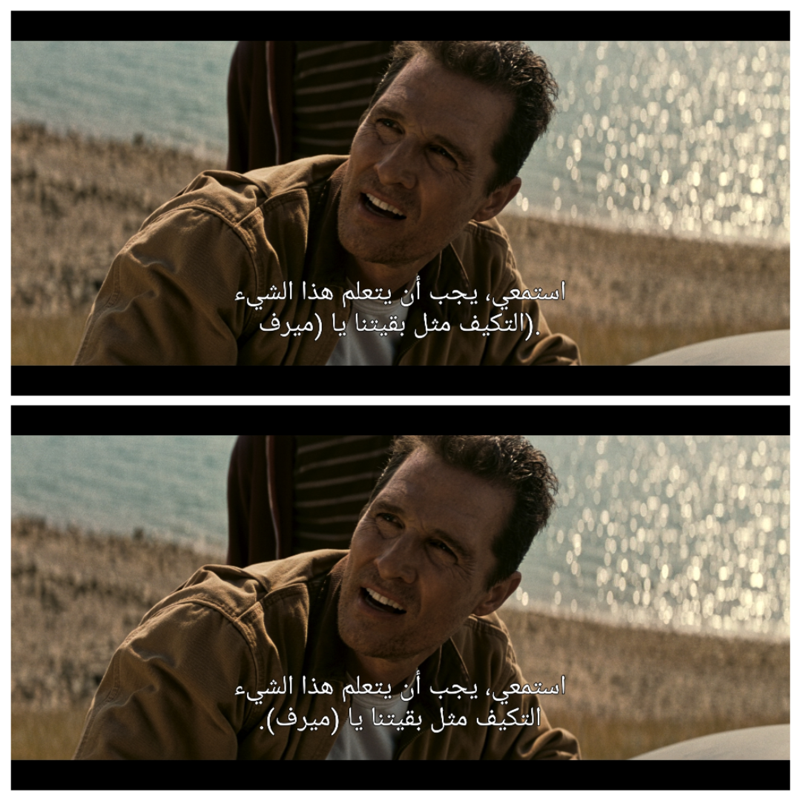
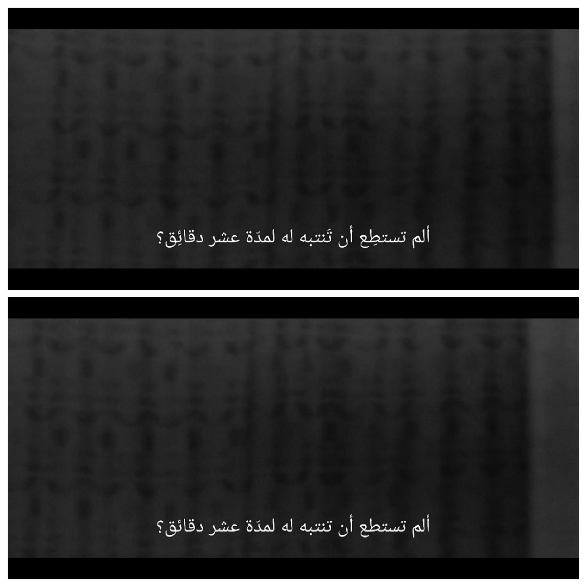
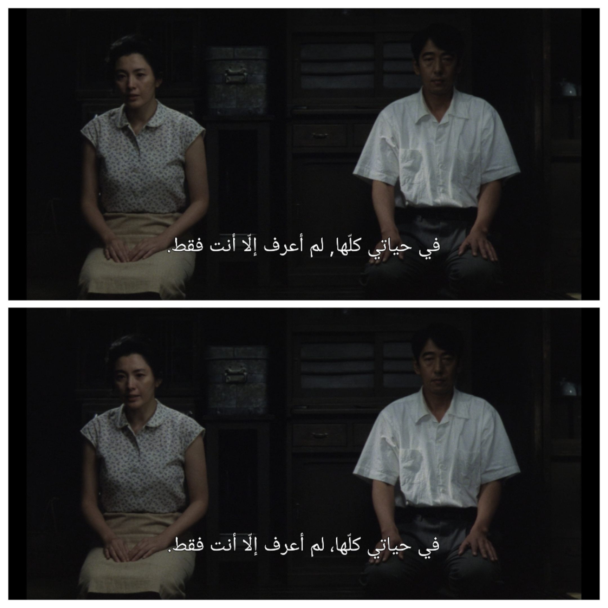
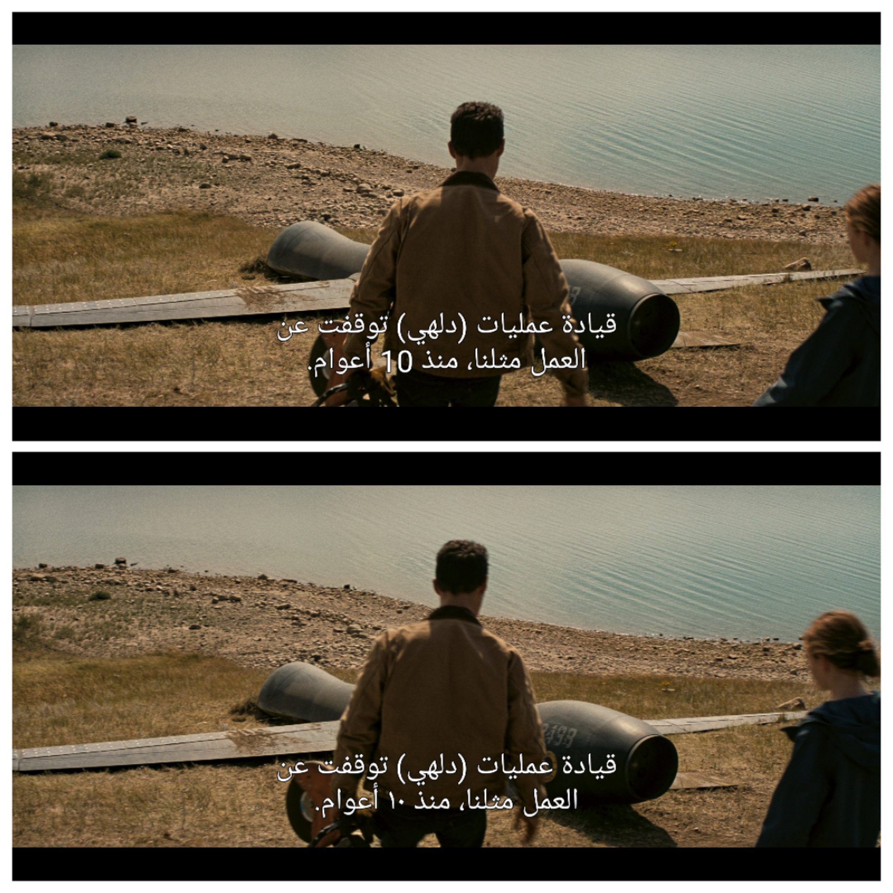
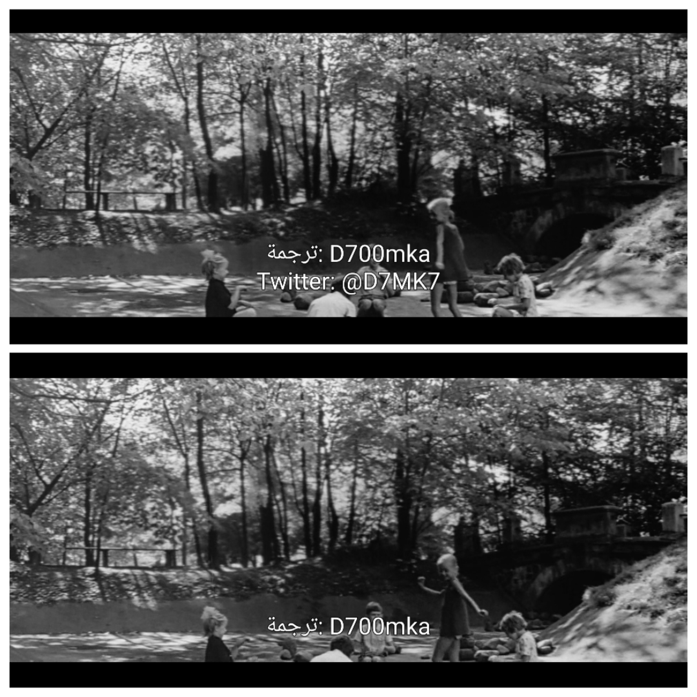
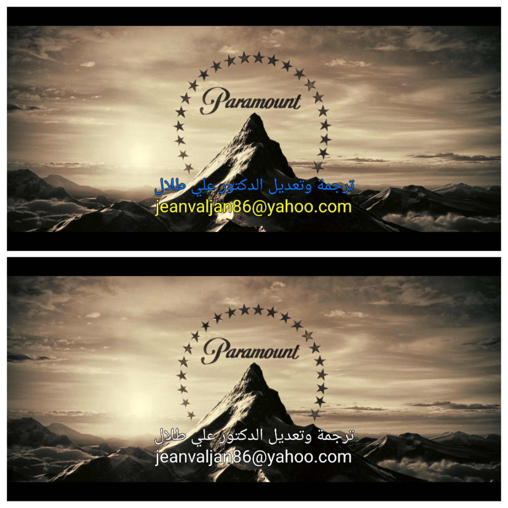
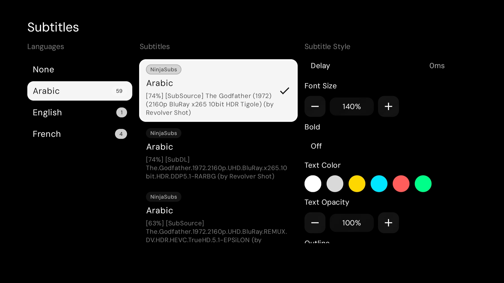

<div align="center">


**Smart subtitle aggregator for Stremio with an advanced Arabic text & BiDi processing engine.**

[](https://www.python.org/)
[](https://fastapi.tiangolo.com/)
[](https://www.docker.com/)
[](LICENSE)

[English](#-english) · [العربية](#-العربية) · [Screenshots](#screenshots)

</div>

---

## 🇬🇧 English

A lightweight, self-hosted [Stremio](https://stremio.com) subtitle addon built with **Python 3.11+**, **FastAPI**, and **Uvicorn**. It aggregates subtitles from **five providers**, unpacks archives safely in memory, and streams native subtitles with a dedicated **Arabic Language Engine** for BiDi, punctuation, diacritics and numeral normalization.

### Highlights

- **Multi-provider aggregation** — SubDL, SubSource, OpenSubtitles, YIFYSubtitles and SubtitleCat queried in parallel (`asyncio.gather`) with per-provider timeouts and resilient fallback.
- **Arabic Language Engine** — context-aware RTL alignment, reversal repair, optional Tashkeel (diacritics) removal, Eastern-Arabic numerals and in-dialogue HI cleanup.
- **Stateless, per-user configuration** — every preference and API key is serialized into a URL-safe Base64 token embedded in the manifest URL; nothing is stored server-side.
- **Informative match badges** — compose the subtitle label from match score, provider, release filename and uploader.
- **Low footprint** — in-memory ZIP extraction (Zip Slip protected), LRU disk cache, and strict memory limits.

### Subtitle Providers

| Provider | Access | Default | Notes |
| :--- | :--- | :---: | :--- |
| **SubDL** | API key | ✅ on | Primary source, broad release coverage |
| **SubSource** | API key | ✅ on | Strong community uploads |
| **OpenSubtitles** | API key | ⛔ off | Optional; quota-aware |
| **YIFYSubtitles** | Keyless | ⛔ off | Movies only (IMDb lookup) |
| **SubtitleCat** | Keyless | ⛔ off | Machine-translated `.srt` files |

### Features & Preferences

Every setting below is an independent, opt-in preference available in the [configuration UI](#configuration-ui). Choices are serialized into the stateless manifest token and included in the cache key, so toggling one never serves stale subtitles.

#### Arabic Language Engine
All Arabic processing is applied at **serve time** (per user) and is fully toggleable:

* **Arabic RTL Alignment Fix** — Automatically fix inverted punctuation, brackets, and quotes in Arabic subtitles to prevent misplaced periods.

<details id="screenshots">
<summary>🔍 <b>View Screenshot</b></summary>
<br>

</details>

* **Strip Arabic diacritics (Tashkeel)** — Removes Harakat while keeping Shadda, Tanween, and feminine Kasra.

<details>
<summary>🔍 <b>View Screenshot</b></summary>
<br>

</details>

* **Normalize Arabic commas** — Converts Latin commas in Arabic text to Arabic commas.

<details>
<summary>🔍 <b>View Screenshot</b></summary>
<br>

</details>

* **Convert numbers to Eastern Arabic** — Converts Western digits to Eastern Arabic numerals in Arabic dialogue.

<details>
<summary>🔍 <b>View Screenshot</b></summary>
<br>

</details>


#### Dialogue & Clean-up

- **Exclude HI (Hearing Impaired)**: Filters out tracks containing sound effects and audio descriptions. **(Hides entire HI subtitle tracks from the list)**
- **Strip In-dialogue HI Labels**: Cleans sound effects, audio cues, and speaker names while keeping dialogue intact (e.g. `[LAUGHS] JOHN: Hello there!` → `Hello there!`). **(Keeps the subtitle track, but removes the HI text inside it)**
- **Remove Ads**: Strips promotional links, websites, and social handles, then re-indexes SRT cues (e.g. Watch free at [www.example.com](https://www.example.com) — @promo_channel → (cue removed)).
- **Keep Translator Credits**: Preserves translator attribution lines while cleanly dropping attached spam and links.

<details>
<summary>🔍 <b>View Screenshot</b></summary>
<br>

* **Remove Ads:** [ON] — **Keep Translator Credits:** [ON]


</details>


#### Text Formatting & Timing

- **Clean Tags**: Balances and closes unclosed formatting tags (`<i>`/`<b>`) and removes unsupported wrappers (e.g. `<i>- Hello! <custom>world</custom>` → `<i>- Hello! world</i>`).
- **Strip Text Colors**: Removes HTML font color tags and ASS color codes (`{\c&H...&}`) to enforce the player's native styling (e.g. `<font color="#ff0000">Hello</font>` → `Hello`).

<details>
<summary>🔍 <b>View Screenshot</b></summary>
<br>

</details>

- **Normalize Spacing**: Collapses duplicate spaces and removes spaces before punctuation (e.g. `word  ,  next` → `word, next`).
- **Clean Symbols & Breaks**: Converts stray double hyphens into ellipses and removes stray `<br>` tags (e.g. `-- Wait <br>` → `... Wait`).
- **Fix Display Timing**: Clamps micro-overlaps (< 500ms) between consecutive cues to stop player flickering (e.g. `00:00:01,000 --> 00:00:03,000` & `00:00:02,800 --> 00:00:05,000` → clamped to `00:00:02,800`).

### Subtitle Badge Customizer
Customizes how subtitle tracks appear inside the Stremio or Nuvio player interface, allowing you to toggle and reorder metadata tags to match your preference:

* **Match Score (`[100%]`)** — Displays the filename matching accuracy score against the playing video stream.
* **Provider Tag (`[SubDL]`)** — Identifies the upstream subtitle provider source.
* **Release Name** — Displays the original video release tag (e.g. `WEB-DL-FLUX`).
* **Translator Credit (`(by 'username')`)** — Displays the subtitle author or translator.

<details>
<summary>🔍 <b>View Screenshot</b></summary>
<br>

</details>

### Arabic Language Engine

All Arabic processing is applied at **serve time** (per user) and is fully toggleable:

- **RTL punctuation & BiDi alignment** — appends a Right-to-Left Mark (RLM, `U+200F`) after trailing neutral punctuation so sentence-ending marks stay on the left; repairs legacy "reverse RTL" hacks and mirrored brackets/quotes, and fixes pre-reversed dialogue dashes.
- **Clean syntax & formatting** — independent toggles for tag repair, spacing, symbols (`-- → ...`), Latin→Arabic commas, unsafe/unclosed HTML `tags`, and display-timing overlap clamping (< 500 ms).
- **Strip Arabic diacritics (Tashkeel)** — removes Harakat while keeping Shadda, all Tanween types, and the feminine Kasra.
- **Convert to Eastern Arabic numerals** — (1, 2, 3) to (١، ٢، ٣), while protecting tags, timestamps and Latin/alphanumeric tokens (AK-47, MP4, Windows 11).
- **Strip in-dialogue HI labels** — removes `[MUSIC]`, `(SIGHS)`, `JOHN:` artifacts while keeping dialogue.
- **Encoding safety** — transcodes CP1256 / ISO-8859-6 to clean UTF-8.

### Quick Start (Docker)

```bash
cp .env.example .env
# set BASE_URL to your LAN address, e.g. http://192.168.1.50:7000

docker compose up -d --build
docker compose logs -f
```

Open `http://<HOST_IP>:7000/configure`, enter your keys, then **Install to Stremio** or **Copy Link**.

### Configuration UI

The web UI is a 3-step wizard and a stateless token:

1. **Providers** — pick sources and paste API keys.
2. **Preferences** — language engine, cleaning toggles, badge preview.
3. **Install** — addon host, Stremio install actions and the generated manifest URL.

### API Endpoints

| Endpoint | Method | Description |
| :--- | :--- | :--- |
| `/configure` | `GET` | Configuration wizard |
| `/{config}/configure` | `GET` | Prefilled configuration wizard |
| `/manifest.json` | `GET` | Default Stremio v3 manifest |
| `/{config}/manifest.json` | `GET` | User-configured manifest |
| `/subtitles/{type}/{id}.json` | `GET` | Subtitle search (server keys) |
| `/{config}/subtitles/{type}/{id}.json` | `GET` | Subtitle search (user keys) |
| `/sub/{sub_id}.srt` | `GET` | Serve UTF-8 subtitle |
| `/health` | `GET` | Health + cache statistics |

### Local Development

```bash
python -m venv .venv
.venv\Scripts\Activate.ps1        # Windows
# source .venv/bin/activate       # Linux/macOS

pip install -r requirements.txt
uvicorn app.main:app --host 0.0.0.0 --port 7000 --reload

pytest -q                          # tests
ruff check .                       # lint
mypy app                           # types
```

### License

This project is licensed under the **MIT License** — see [LICENSE](LICENSE).

> Note: the UI font "Serif Black" (`app/static/fonts/SerifBlackItalic.ttf`) is licensed by its source for personal use only.

---

## 🇸🇦 العربية

إضافة ترجمة خفيفة وذاتية الاستضافة لـ [Stremio](https://stremio.com)، مبنية بـ **Python 3.11+** و**FastAPI** و**Uvicorn**. تجمع الترجمة من **خمسة مصادر**، وتفكّ ضغط الملفات داخل الذاكرة بأمان، وتبثّ الترجمة مع **محرّك خاص باللغة العربية** لمعالجة الاتجاه (BiDi) وعلامات الترقيم والتشكيل والأرقام.

### أبرز المزايا

- **تجميع من عدة مصادر** — SubDL وSubSource وOpenSubtitles وYIFYSubtitles وSubtitleCat بالتوازي (`asyncio.gather`) مع مهلة لكل مصدر واحتياطي عند الفشل.
- **محرّك اللغة العربية** — ضبط اتجاه النص من اليمين لليسار، وإصلاح النص المعكوس، وإزالة التشكيل (اختياري)، وتحويل الأرقام إلى الأرقام العربية المشرقية، وتنظيف وسوم الصوت الوصفية.
- **إعدادات لكل مستخدم بدون حفظ** — تُرمّز كل الإعدادات ومفاتيح الـ API داخل رابط الـ manifest (Base64) ولا يُخزَّن شيء على الخادم.
- **شارات مطابقة غنية** — تتكوّن من نسبة المطابقة والمصدر واسم الإصدار واسم الرافع.
- **استهلاك منخفض** — فكّ ضغط داخل الذاكرة (مع حماية Zip Slip) وذاكرة تخزين LRU مؤقتة.

### مصادر الترجمة

| المصدر | الوصول | الافتراضي | ملاحظات |
| :--- | :--- | :---: | :--- |
| **SubDL** | مفتاح API | ✅ مُفعّل | المصدر الأساسي وواسع التغطية |
| **SubSource** | مفتاح API | ✅ مُفعّل | ترجمات مجتمعية قوية |
| **OpenSubtitles** | مفتاح API | ⛔ معطّل | اختياري مع مراعاة الحصة |
| **YIFYSubtitles** | بدون مفتاح | ⛔ معطّل | للأفلام فقط |
| **SubtitleCat** | بدون مفتاح | ⛔ معطّل | ملفات مترجمة آليًا |

### المزايا والتفضيلات

كل إعداد أدناه تفضيل مستقل واختياري متاح في [واجهة الإعدادات](#واجهة-الإعدادات). تُرمّز الخيارات داخل رمز الـ manifest بدون حفظ على الخادم، وتُدرج في مفتاح الذاكرة المؤقتة، لذا لا يُقدَّم محتوى قديم عند تغيير أي إعداد.

#### محرّك اللغة العربية
تُطبَّق جميع معالجات اللغة العربية لحظيًا عند طلب الترجمة (لكل مستخدم) مع إمكانية تفعيلها أو تعطيلها بالكامل:

- **ضبط الاتجاه والترقيم** — إصلاح تلقائي للترقيم والأقواس والاقتباسات المعكوسة في الترجمات العربية لمنع ظهور النقاط في غير موضعها.

<details>
<summary>🔍 <b>عرض لقطة الشاشة</b></summary>
<br>

</details>

- **إزالة التشكيل (Tashkeel)** — إزالة الحركات مع الحفاظ على الشدة وجميع أنواع التنوين والكسرة للمؤنث.

<details>
<summary>🔍 <b>عرض لقطة الشاشة</b></summary>
<br>

</details>

- **توحيد الفواصل العربية** — تحويل الفواصل اللاتينية إلى الفاصلة العربية في النص العربي.

<details>
<summary>🔍 <b>عرض لقطة الشاشة</b></summary>
<br>

</details>

- **تحويل الأرقام إلى الأرقام المشرقية** — تحويل الأرقام من (1, 2, 3) إلى (١، ٢، ٣) في الحوار العربي مع حماية الطوابع الزمنية والوسوم والرموز اللاتينية.

<details>
<summary>🔍 <b>عرض لقطة الشاشة</b></summary>
<br>

</details>

#### الحوار والتنظيف

- **استبعاد الصوت الوصفي (HI)**: استبعاد المسارات التي تحتوي على مؤثرات صوتية وأوصاف سمعية. **(يُخفي مسارات HI كاملة من القائمة)**
- **تنظيف وسوم HI داخل الحوار**: تنظيف المؤثرات الصوتية والإشارات الصوتية وأسماء المتحدثين مع الإبقاء على الحوار (مثال `[LAUGHS] JOHN: Hello there!` ← `Hello there!`). **(يبقي مسار الترجمة، لكن يحذف نص HI الموجود داخله)**
- **إزالة الإعلانات**: إزالة الروابط والمواقع والمعرّفات الاجتماعية والنص الترويجي، ثم إعادة ترقيم مقاطع SRT (مثال Watch free at [www.example.com](https://www.example.com) — @promo_channel ← (cue removed)).
- **الإبقاء على حقوق المترجم**: الحفاظ على سطور نسب المترجم مع إزالة الروابط والسبام الملتصقة بها.

<details>
<summary>🔍 <b>عرض لقطة الشاشة</b></summary>
<br>

* **إزالة الإعلانات:** [ON] — **الإبقاء على حقوق المترجم:** [ON]


</details>

#### تنسيق النص والتوقيت

- **تنظيف الوسوم**: موازنة وإغلاق وسوم التنسيق غير المغلقة (`<i>`/`<b>`) وإزالة الأغلفة غير المدعومة (مثال `<i>- Hello! <custom>world</custom>` ← `<i>- Hello! world</i>`).
- **إزالة ألوان النص**: إزالة وسوم ألوان HTML وأكواد ألوان ASS (`{\c&H...&}`) لفرض التنسيق الأصلي للمشغل (مثال `<font color="#ff0000">Hello</font>` ← `Hello`).

<details>
<summary>🔍 <b>عرض لقطة الشاشة</b></summary>
<br>

</details>

- **توحيد المسافات**: دمج المسافات المكررة وإزالة المسافات الزائدة قبل علامات الترقيم (مثال `word  ,  next` ← `word, next`).
- **تنظيف الرموز والفواصل**: تحويل الشرطات المزدوجة إلى علامة حذف (`...`) وإزالة وسوم `<br>` الزائدة (مثال `-- Wait <br>` ← `... Wait`).
- **ضبط توقيت العرض**: قص التداخلات الدقيقة (< 500ms) بين المقاطع المتتالية لمنع وميض الترجمة (مثال `00:00:01,000 --> 00:00:03,000` و`00:00:02,800 --> 00:00:05,000` ← تُضبط إلى `00:00:02,800`).

### تخصيص شارات الترجمة (Subtitle Badge Customizer)
يتيح لك تخصيص مظهر مسارات الترجمة داخل مشغل Stremio أو Nuvio، مع إمكانية إظهار أو إخفاء وإعادة ترتيب الوسوم والمعلومات حسب رغبتك:

* **نسبة التطابق (`[100%]`)** — تعرض دقة تطابق ملف الترجمة مع ملف الفيديو المشغّل.
* **وسم المصدر (`[SubDL]`)** — يوضح الموقع أو المزود الذي تم جلب ملف الترجمة منه.
* **اسم النسخة (Release Name)** — يوضح وسم نسخة الفيديو الأصلية (مثل `WEB-DL-FLUX`).
* **حقوق المترجم (`(by 'username')`)** — تعرض اسم المترجم أو رافع ملف الترجمة الأصلي.

<details>
<summary>🔍 <b>عرض لقطة الشاشة</b></summary>
<br>

</details>

### محرّك اللغة العربية

تُطبَّق جميع معالجات اللغة العربية لحظيًا عند طلب الترجمة (لكل مستخدم) مع إمكانية تفعيلها أو تعطيلها بالكامل:

- **ضبط الاتجاه والترقيم** — إضافة علامة RLM (`U+200F`) بعد علامات الترقيم النهائية، وإصلاح حيل "RTL المعكوس" القديمة والأقواس/الاقتباسات المقلوبة، وضبط شَرطات الحوار المسبقة.
- **تنظيف الصياغة والتنسيق** — خيارات مستقلة لإصلاح الوسوم والمسافات والرموز (`-- ← ...`) والفواصل اللاتينية، ووسوم HTML غير الآمنة، وضبط تداخل التوقيت (< 500ms).
- **إزالة التشكيل (Tashkeel)** — إزالة الحركات مع الحفاظ على الشدة وجميع أنواع التنوين وكسرة المؤنث.
- **تحويل الأرقام إلى الأرقام العربية المشرقية** — تحويل الأرقام من (1, 2, 3) إلى (١، ٢، ٣)، مع حماية الوسوم والطوابع الزمنية والرموز اللاتينية (AK-47, MP4, Windows 11).
- **تنظيف وسوم الصوت الوصفية** — إزالة `[MUSIC]` و`(SIGHS)` و`JOHN:` مع الإبقاء على الحوار.

### التشغيل السريع (Docker)

```bash
cp .env.example .env
# اضبط BASE_URL على عنوان الشبكة المحلية، مثال: http://192.168.1.50:7000

docker compose up -d --build
docker compose logs -f
```

ثم افتح `http://<HOST_IP>:7000/configure`، أدخل المفاتيح، واضغط **Install to Stremio** أو **Copy Link**.

### واجهة الإعدادات

تتكوّن الواجهة من معالج من 3 خطوات ورمز بدون حفظ:

1. **المصادر** — اختيار المصادر ولصق مفاتيح الـ API.
2. **التفضيلات** — محرّك اللغة، خيارات التنظيف، ومعاينة الشارة.
3. **التثبيت** — عنوان الإضافة، وأزرار التثبيت في Stremio، ورابط الـ manifest المُنشأ.

### نقاط النهاية (API)

| نقطة النهاية | الطريقة | الوصف |
| :--- | :--- | :--- |
| `/configure` | `GET` | معالج الإعدادات |
| `/{config}/configure` | `GET` | معالج الإعدادات مع القيم المحفوظة |
| `/manifest.json` | `GET` | ملف manifest الافتراضي لـ Stremio v3 |
| `/{config}/manifest.json` | `GET` | ملف manifest المخصّص بالمفاتيح الشخصية |
| `/subtitles/{type}/{id}.json` | `GET` | البحث عن الترجمات (مفاتيح الخادم) |
| `/{config}/subtitles/{type}/{id}.json` | `GET` | البحث عن الترجمات (مفاتيح المستخدم) |
| `/sub/{sub_id}.srt` | `GET` | تقديم ملف ترجمة UTF-8 |
| `/health` | `GET` | حالة الخدمة وإحصاءات الذاكرة المؤقتة |

### التطوير المحلي

```bash
python -m venv .venv
.venv\Scripts\Activate.ps1        # Windows
# source .venv/bin/activate       # Linux/macOS

pip install -r requirements.txt
uvicorn app.main:app --host 0.0.0.0 --port 7000 --reload

pytest -q                          # tests
ruff check .                       # lint
mypy app                           # types
```

### الترخيص

هذا المشروع مُرخّص تحت **رخصة MIT** — انظر ملف [LICENSE](LICENSE).

> ملاحظة: خط الواجهة «Serif Black» (باستخدام `app/static/fonts/SerifBlackItalic.ttf`) مُرخّص من مصدره للاستخدام الشخصي فقط.

---

<div align="center">

**Free & Open Source for the community · v1.0.0**

[github.com/donsaud/NinjaSubs](https://github.com/donsaud/NinjaSubs)

</div>
